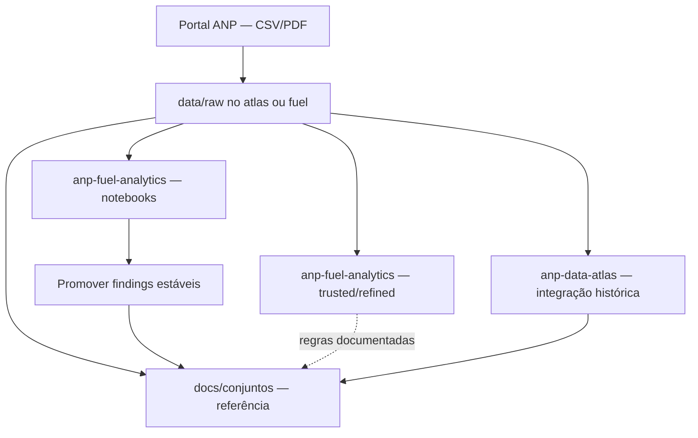

# anp-data-atlas

Atlas de referência dos dados abertos da ANP: documentação em Markdown e **integração histórica** dos conjuntos (série consolidada no tempo).

## Objetivo

Este repositório é uma **referência exploratória** dos dados publicados pela [Agência Nacional do Petróleo, Gás Natural e Biocombustíveis (ANP)](https://www.gov.br/anp/pt-br). Ele reúne:

- **Documentação** em Markdown — metadados, contexto, dicionário de colunas, matriz de arquivos e lacunas;
- **Pipelines de integração** — baixar brutos, harmonizar meses/blocos e produzir série histórica utilizável (`data/raw/` → processamento documentado);
- **Descobertas** incorporadas a partir de explorações no [anp-fuel-analytics](https://github.com/GabrielTrentino/anp-fuel-analytics) (notebooks exploratórios).

| Repositório | Papel |
|-------------|--------|
| **anp-data-atlas** | Referência + **integração histórica** por assunto |
| [anp-fuel-analytics](https://github.com/GabrielTrentino/anp-fuel-analytics) | **Análises exploratórias** (perfil, qualidade, pilotos) que validam o que entra no atlas |

A ideia é servir de base para outros projetos — quem for construir análises, dashboards ou modelos pode consultar este atlas antes de reimplementar explorações do zero.

## O que cada repositório guarda

Divisão de responsabilidades entre este atlas e o [anp-fuel-analytics](https://github.com/GabrielTrentino/anp-fuel-analytics):

| Conteúdo | **anp-data-atlas** (este repo) | **anp-fuel-analytics** |
|----------|-------------------------------|-------------------------|
| Metadados oficiais ANP | Sim — `docs/conjuntos/` | Link para o atlas |
| Matriz de URLs e lacunas do portal | Sim | Usa o atlas como referência |
| Inventário empírico dos brutos (linhas, m³, `Data` por arquivo) | Sim — quando estabilizado | Notebooks geram e validam |
| Schema confirmado na prática | Sim — resumo em Markdown | Código + tabelas completas |
| Chave candidata, regras de agregação | Sim | Prova nos notebooks |
| Anomalias documentadas (ex.: nov/dez 2022) | Sim — seção de qualidade | Investigação ativa (`TODO.md`) |
| Gráficos, `describe()`, experimentos | Não | Sim — notebooks |
| Camadas trusted / refined | Não | Sim — pipelines na raiz |
| Pipelines de integração histórica | Sim — `pipelines/` (planejado) | Protótipos por estudo |

**Promover para o atlas** quando a informação for reproduzível, útil para integração (ETL, chaves, lacunas) e relativamente estável. **Manter no fuel-analytics** gráficos exploratórios, comparações analíticas e hipóteses ainda em aberto.

No atlas, cada conjunto tem um `.md` em `docs/conjuntos/` com seções como: estrutura oficial, inventário empírico, qualidade/chaves e link para a exploração ativa nos notebooks — sem duplicar o notebook inteiro.

## Fluxo de processamento

Visão geral de como os dados circulam entre portal, repositórios e documentação:



| Etapa | Onde | O que acontece |
|-------|------|----------------|
| 1. Fonte | Portal ANP | Publicação mensal ou em blocos; metadados em PDF |
| 2. Raw local | `data/raw/{slug}/` | Cópia fiel dos arquivos (não versionada no Git) |
| 3. Exploração | [anp-fuel-analytics](https://github.com/GabrielTrentino/anp-fuel-analytics) | Perfil, qualidade, inventário por arquivo nos notebooks |
| 4. Documentação | `docs/conjuntos/{slug}.md` | Metadados oficiais + inventário empírico + regras de integração |
| 5. Integração histórica | `pipelines/` (atlas, planejado) | Harmonizar lacunas/blocos e série consolidada documentada |
| 6. Camadas analíticas | fuel-analytics (`trusted` / `refined`) | Protótipos ETL; regras estáveis voltam para o atlas |

Neste repositório, o foco do processamento é **documentar** o caminho raw → série utilizável. A implementação pesada de trusted/refined fica no fuel-analytics até a integração histórica do atlas estar madura.

## O que promover para o atlas (e o que não)

### Promover (sim)

| Tipo | Exemplo | Onde no atlas |
|------|---------|---------------|
| Schema confirmado em amostras reais | `Cnpj` como texto; 12 colunas de negócio | Estrutura dos arquivos |
| Domínios categóricos estáveis | 4 valores de `GrupoDeProdutos` | Estrutura / qualidade |
| Chave lógica validada | `Data` + `CodInstalacao` + `Tag` + `GrupoDeProdutos` sem duplicatas | Qualidade e chaves |
| Inventário por arquivo baixado | linhas, soma m³, faixa de `Data` | Inventário empírico |
| Lacunas e blocos do portal | abr/2025 ausente; `marco-julho.csv` | Matriz / periodicidade |
| Anomalia confirmada | queda nov/dez 2022 com evidência | Anomalias conhecidas |
| Regra de agregação | somar `TancagemM3` no nível da chave; não duplicar `Tag` | Qualidade e chaves |
| Decisão de ETL | descartar linhas 100% nulas na trusted | Qualidade (quando validado) |

### Não promover (ficar no fuel-analytics)

| Tipo | Exemplo | Onde ficar |
|------|---------|------------|
| Outputs de célula | `df.describe()`, tabelas gigantes | Notebook |
| Gráficos exploratórios | ranking UF, GO vs SP | Notebook |
| Hipótese em aberto | “será corte parcial em 2022?” | `TODO.md` do estudo |
| Código de pipeline | SQL DuckDB, `run.py` | `pipelines/` |
| Análise de negócio | HHI, participação de mercado | Notebook ou projeto derivado |
| Números de uma execução só | contagem exata sem data de referência | Reexecutar e documentar com snapshot |

### Critérios (checklist)

Promova quando **todas** forem verdadeiras:

1. **Reproduzível** — outra pessoa com os mesmos CSVs deve chegar à mesma conclusão.
2. **Útil para integração** — ajuda ETL, chaves, harmonização temporal ou leitura do dicionário.
3. **Estável** — não depende de um notebook em edição; vale após revisão.
4. **Referenciável** — indique fonte (arquivo, notebook, data da medição).

Se falhar em (3) ou (4), mantenha no fuel-analytics até fechar a investigação.

## Estrutura prevista

```
anp-data-atlas/
├── docs/
│   ├── dados-abertos.md   # Catálogo oficial (índice dos 42 conjuntos)
│   └── conjuntos/         # Exploração por conjunto (metadados, contexto)
├── pipelines/             # Integração histórica por conjunto (série consolidada)
└── data/
    └── raw/{slug}/        # Dados brutos por conjunto (não versionados)
```

Os arquivos em `data/raw/` ficam no `.gitignore`. O repositório versiona a **lógica** (pipelines) e o **conhecimento** (docs), não os datasets.

## Dados brutos

Mantemos somente a camada **raw** — arquivos originais da fonte, sem alteração estrutural — para inspecionar metadados, entender o contexto de cada conjunto e registrar as descobertas em `docs/`. Tratamentos e camadas derivadas ficam fora deste repositório, em projetos que consumirem este atlas.

## Fonte dos dados

Os dados brutos são **dados abertos da ANP**. A reutilização segue os termos e políticas definidos pela agência e pelo governo federal — este repositório **não relicencia** o conteúdo original da ANP, apenas documenta e armazena localmente para exploração.

Ao publicar análises ou derivados, cite a fonte oficial da ANP e consulte as condições vigentes no portal de dados abertos.

## Licenciamento

| Conteúdo | Licença |
|----------|---------|
| Código, pipelines e documentação deste repositório | [MIT](LICENSE) |
| Dados originais da ANP | Termos da ANP / dados abertos governamentais |
| Datasets derivados publicados no futuro | Recomendado: [CC BY 4.0](https://creativecommons.org/licenses/by/4.0/deed.pt) (se houver redistribuição de dados processados) |

Sem um arquivo `LICENSE`, o padrão legal é “todos os direitos reservados”. Este projeto usa **MIT** para permitir cópia e reutilização do código e da documentação com atribuição.

## Documentação

O catálogo completo dos conjuntos publicados pela ANP está em **[docs/dados-abertos.md](docs/dados-abertos.md)** (42 conjuntos no portal, documentos relacionados e índice de exploração).

## Como usar

1. Clone o repositório.
2. Consulte [docs/dados-abertos.md](docs/dados-abertos.md) e escolha um conjunto.
3. Baixe o [Inventário de Dados ANP](#inventário-de-dados-anp) (opcional) para visão institucional das ~240 bases internas.
4. Execute os pipelines em `pipelines/` para baixar os dados brutos em `data/raw/{slug}/`.
5. Leia ou escreva a exploração em `docs/conjuntos/` — metadados, inventário empírico e regras de integração.

> Os pipelines e a documentação serão expandidos conforme cada conjunto de dados da ANP for explorado.

## Inventário de Dados ANP

Planilha oficial que cataloga as bases de dados mantidas pela ANP — distinta do [catálogo de 42 conjuntos](docs/dados-abertos.md) expostos na página de dados abertos, porém útil para cruzar nome institucional, unidade responsável e periodicidade.

| Item | Detalhe |
|------|---------|
| **Arquivo** | [inventario-dados.xlsx](https://www.gov.br/anp/pt-br/centrais-de-conteudo/dados-abertos/arquivos/home/inventario-dados.xlsx) |
| **Atualização no portal** | 5/12/2025 |
| **Cópia local** | `data/raw/_catalogo-anp/inventario-dados.xlsx` (gitignored) |
| **Planilha** | `Dados ANP` — **240 bases** catalogadas |
| **Colunas** | Nome da base · Descrição · Unidade responsável · Disponível no dados.gov.br? · Periodicidade · Política pública relacionada · Conteúdo sigiloso? |

### O que há no inventário (análise da cópia local, mai/2026)

| Métrica | Valor |
|---------|------:|
| Bases catalogadas | 240 |
| Marcadas como disponíveis no Portal Brasileiro de Dados Abertos | 182 |
| Sem conteúdo sigiloso (maioria) | ~237 |

**Unidades responsáveis mais frequentes:** SDC (estatística/conjuntura), SDT (dados técnicos), SEP, SDP, SPL, SDL (distribuição/logística), SPG, SIM (mercado), SCL, SFI (fiscalização), entre outras.

**Periodicidades mais comuns:** Mensal (81) · Anual (65) · Diária (28) · Semestral (22) · Conforme demanda (14) · Rodada (8) · Semanal (6) · Trimestral (4).

### Relação com este atlas

| Inventário ANP (240 bases) | Catálogo dados abertos (42 conjuntos) | Exploração `docs/conjuntos/` |
|--------------------------|---------------------------------------|------------------------------|
| Visão **institucional** — tudo que a ANP registra como base | Visão **pública** — o que está na página de download | Visão **empírica** — schema, arquivos medidos, lacunas e ETL |
| Nome + unidade + periodicidade | URL + formato + contexto de uso | Inventário por CSV baixado |

Nem toda base do inventário aparece como conjunto baixável na página de 42 itens; nem todo conjunto público está nomeado igual no inventário.

### Entrada de tancagem no inventário

| Campo | Valor |
|-------|-------|
| Nome | Tancagem do Abastecimento Nacional de Combustíveis (2022 - 2023 - 2024) |
| Unidade | SIM |
| Periodicidade | Mensal |
| dados.gov.br | Sim |

O rótulo no inventário cita apenas **2022–2024**, mas o portal já publica **2025–2026** — usar a [matriz de arquivos](docs/conjuntos/tancagem-abastecimento.md#arquivos-disponíveis-no-portal) e o [inventário empírico](docs/conjuntos/tancagem-abastecimento.md#inventário-empírico-dos-brutos) como fonte atualizada.

### Outras bases relacionadas a combustíveis (amostra)

| Base (inventário) | Unidade | Periodicidade |
|-------------------|---------|---------------|
| Capacidade de armazenamento dos terminais… | SIM | Semestral |
| Movimentação de Derivados… (combustíveis líquidos, GLP, TRR, etc.) | SDL | Mensal |
| Dados Cadastrais dos Revendedores Varejistas… | SDL | Diária |
| Dados Cadastrais de Pontos de Abastecimento Autorizados | SDL | Diário |
| PMQC — Qualidade dos Combustíveis | SBQ | Mensal |
| Ações de Fiscalização do Abastecimento | SFI | Mensal |

Conjunto completo: abrir a planilha ou filtrar por palavras-chave (*combust*, *tancagem*, *abastec*, *derivados*) — ~30 entradas no inventário tocam abastecimento/combustíveis de forma direta ou indireta.

## Repositório

https://github.com/GabrielTrentino/anp-data-atlas
