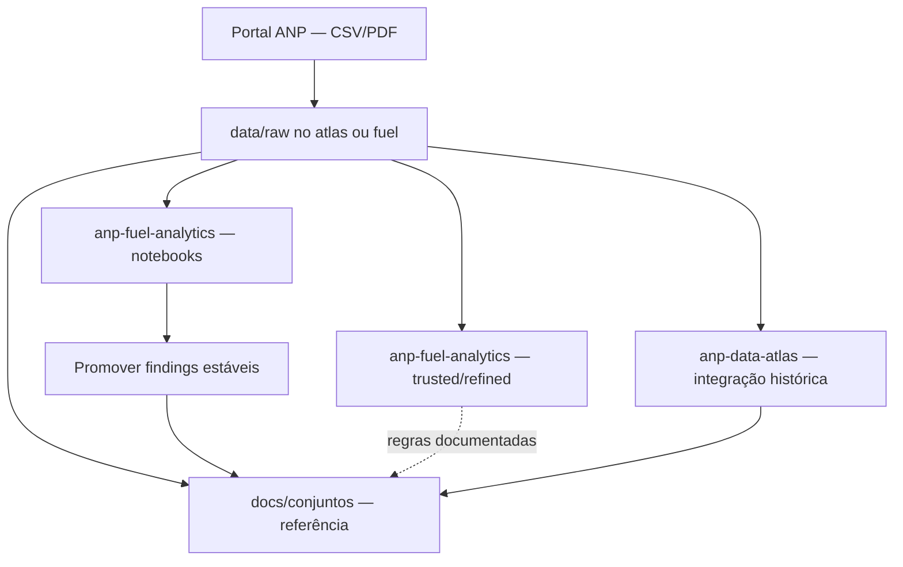

# anp-data-atlas

Atlas de referência dos dados abertos da ANP: documentação em Markdown e **integração histórica** dos conjuntos (série consolidada no tempo).

## Objetivo

Este repositório é uma **referência exploratória** dos dados publicados pela [Agência Nacional do Petróleo, Gás Natural e Biocombustíveis (ANP)](https://www.gov.br/anp/pt-br). Ele reúne:

- **Documentação** em Markdown — metadados, contexto, dicionário de colunas, matriz de arquivos e lacunas;
- **Pipelines de integração** — baixar brutos, harmonizar meses/blocos e produzir série histórica utilizável (`data/raw/` → processamento documentado);
- **Descobertas** incorporadas a partir de explorações no [anp-fuel-analytics](https://github.com/GabrielTrentino/anp-fuel-analytics) (notebooks exploratórios).

| Repositório | Papel |
|-------------|--------|
| **anp-data-atlas** | Referência + **integração histórica** por assunto |
| [anp-fuel-analytics](https://github.com/GabrielTrentino/anp-fuel-analytics) | **Análises exploratórias** (perfil, qualidade, pilotos) que validam o que entra no atlas |

A ideia é servir de base para outros projetos — quem for construir análises, dashboards ou modelos pode consultar este atlas antes de reimplementar explorações do zero.

## O que cada conjunto traz

Síntese dos **42 conjuntos** da [página de dados abertos](docs/dados-abertos.md) — métrica principal, **variáveis-chave para ligação** (`Data`, `Cnpj`, geo, produto, volume) e conjuntos relacionados. Índice completo com chaves transversais e grafo de cruzamento: **[docs/variaveis-conjuntos.md](docs/variaveis-conjuntos.md)** (✓ = confirmado empiricamente · ~ = inferido do portal).

### Abastecimento, distribuição e mercado downstream

| # | Slug | Métrica | Variáveis-chave | Liga com |
|---|------|---------|-----------------|----------|
| 41 | [`tancagem-abastecimento`](docs/conjuntos/tancagem-abastecimento.md) | Capacidade m³ | `Data`, `Cnpj`, `CodInstalacao`, `Uf`, `Municipio`, `GrupoDeProdutos`, `TancagemM3` ✓ | movimentação, cadastros, preços |
| 21 | [`movimentacao-derivados`](docs/conjuntos/movimentacao-derivados.md) | Volume m³ | `Periodo`, `Cnpj`, `CodInstalacao`, `Produto`, `Operacao` ~ | tancagem, vendas, cadastros |
| 12 | [`cadastro-revendas-combustiveis`](docs/conjuntos/cadastro-revendas-combustiveis.md) | Cadastro postos | `Cnpj`, `Uf`, `Municipio`, `Bandeira`, `Situacao` ~ | tancagem, preços, movimentação |
| 11 | [`cadastro-revendas-glp`](docs/conjuntos/cadastro-revendas-glp.md) | Cadastro GLP | `Cnpj`, `Uf`, `Municipio`, modalidade ~ | movimentação GLP, tancagem |
| 27 | [`pontos-abastecimento`](docs/conjuntos/pontos-abastecimento.md) | Instalações | `CodInstalacao`, `Cnpj`, `Uf`, `Municipio` ~ | cadastros, fiscalização |
| 15 | [`distribuidores-combustiveis-liquidos`](docs/conjuntos/distribuidores-combustiveis-liquidos.md) | Atacado | `Cnpj`, `Uf`, contratos ~ | movimentação, terminais |
| 28 | [`pmqc`](docs/conjuntos/pmqc.md) | Qualidade | `Periodo`, `Produto`, `Uf`, conformidade ~ | fiscalização, cadastros |
| 29 | [`pml`](docs/conjuntos/pml.md) | Lubrificantes | produto, parâmetros, região ~ | registro lubrificantes, movimentação |
| 40 | [`serie-historica-precos`](docs/conjuntos/serie-historica-precos.md) | Preço R$/L | `Produto`, geo, semana/mês, `PrecoMedio` ~ | vendas, cadastros, tancagem |
| 42 | [`vendas-derivados`](docs/conjuntos/vendas-derivados.md) | Volume vendido | `Periodo`, `Produto`, `Uf`, `Municipio`, `Segmento` ~ | movimentação, importações |
| 2 | [`fiscalizacao-abastecimento`](docs/conjuntos/fiscalizacao-abastecimento.md) | Fiscalização | `DataAcao`, `Cnpj`, `Uf`, `Segmento`, resultado ~ | PMQC, cadastros |
| 9 | [`capacidade-armazenagem-terminais`](docs/conjuntos/capacidade-armazenagem-terminais.md) | Capacidade terminal | `Terminal`, `Cnpj`, `Uf`, m³ ~ | tancagem, mov. aquaviária |
| 22 | [`movimentacao-terminais-aquaviarios`](docs/conjuntos/movimentacao-terminais-aquaviarios.md) | Volume terminal | `Terminal`, `Periodo`, `Produto` ~ | capacidade terminais |
| 37 | [`registro-lubrificantes`](docs/conjuntos/registro-lubrificantes.md) | Catálogo produtos | registro ANP, classe, fabricante ~ | PML, movimentação |

### Produção, refino, comércio exterior e estatística consolidada

| # | Slug | Métrica | Variáveis-chave | Liga com |
|---|------|---------|-----------------|----------|
| 32 | [`processamento-petroleo-derivados`](docs/conjuntos/processamento-petroleo-derivados.md) | Refino m³ | refinaria, `Produto`, `Periodo` ~ | vendas, importações |
| 33 | [`producao-biocombustiveis`](docs/conjuntos/producao-biocombustiveis.md) | Produção bio | `Produto`, `Uf`, volume, mês ~ | vendas, preços etanol |
| 34 | [`producao-por-estado`](docs/conjuntos/producao-por-estado.md) | E&P por UF | `Uf`, terra/mar, petróleo/gás, mês ~ | anuário, importações |
| 35 | [`producao-por-poco`](docs/conjuntos/producao-por-poco.md) | E&P por poço | `CodigoPoco`, `Campo`, volumes, mês ~ | produção por estado |
| 19 | [`importacoes-exportacoes`](docs/conjuntos/importacoes-exportacoes.md) | Imp/exp m³ | `Produto`, `Pais`, mês ~ | vendas, refino |
| 5 | [`anuario-estatistico`](docs/conjuntos/anuario-estatistico.md) | Multi-tabela | `Ano`, `Produto`, `Volume`, `Uf` (varia) ~ | benchmark de séries mensais |

### Exploração e produção (E&P)

| # | Slug | Métrica | Variáveis-chave | Liga com |
|---|------|---------|-----------------|----------|
| 13 | `dados-ep` | Agregados E&P | `Bloco`, operador, fase ~ | fases, produção |
| 16 | `fase-exploracao` | Exploração | `Bloco`, `Bacia`, concessionário ~ | rodadas |
| 17 | `fase-desenvolvimento-producao` | D&P | `Campo`, `Bloco`, operador ~ | produção por poço |
| 8 | `blocos-fase-exploratoria-encerrada` | Blocos encerrados | `Bloco`, data encerramento ~ | rodadas |
| 20 | `incidentes-ep` | Incidentes | `Data`, campo, tipo, feridos ~ | produção |
| 38 | `resultado-poco` | Resultado poço | `CodigoPoco`, `Campo`, `Bacia` ~ | produção por poço, acervo |
| 31 | `previsao-atividades-investimentos` | Investimentos | `Bloco`, investimento, ano ~ | rodadas |
| 36 | `relacao-concessionarios` | Concessionários | `Bloco`, `Cnpj`, contrato ~ | rodadas, produção |
| 39 | `rodadas-licitacoes` | Licitações | `Rodada`, `Bloco`, vencedor ~ | concessionários |

### Gás natural

| # | Slug | Métrica | Variáveis-chave | Liga com |
|---|------|---------|-----------------|----------|
| 7 | `autorizacoes-gas-natural` | Autorizações | `Cnpj`, atividade, `Uf` ~ | comercialização, gasodutos |
| 10 | `comercializacao-gas-natural` | Vendas gás | vendedor/comprador, volume, mês ~ | gasodutos |
| 23 | `movimentacao-gas-gasodutos` | Transporte m³ | `Gasoduto`, pontos, mês ~ | comercialização |

### Acervo técnico e geociências

| # | Slug | Métrica | Variáveis-chave | Liga com |
|---|------|---------|-----------------|----------|
| 1 | `acervo-dados-tecnicos` | Poços, sísmica | `CodigoPoco`, tipo, coords ~ | resultado poço, bacias |
| 4 | `amostras-rochas-fluidos` | Amostras | `CodigoPoco`, código amostra ~ | acervo |
| 6 | `aquisicao-processamento-estudo-dados` | Surveys | `Bacia`, survey, área ~ | bacias, acervo |
| 14 | `bacias-sedimentares` | Geometria | `Bacia`, polígonos ~ | blocos, E&P |

### Regulação, fiscalização e participações

| # | Slug | Métrica | Variáveis-chave | Liga com |
|---|------|---------|-----------------|----------|
| 3 | `aditamento-conteudo-local` | Aditamentos | contrato, `Bloco`, % local ~ | fiscalização conteúdo local |
| 18 | `fiscalizacao-conteudo-local` | Conteúdo local | `Bloco`, meta/realizado ~ | aditamentos, rodadas |
| 24 | `multas-2016` | Multas R$ | processo, `Cnpj`, valor ~ | fiscalização |
| 25 | `participacoes-governamentais` | Participação | `Campo`, preço referência ~ | produção E&P |
| 26 | `pesquisa-desenvolvimento-inovacao` | PD&I | `Cnpj`, projeto, investimento ~ | — |
| 30 | `prestadores-apoio-administrativo` | Prestadores | `Cnpj`, tipo serviço ~ | — |

Catálogo completo: [docs/dados-abertos.md](docs/dados-abertos.md) · variáveis e chaves: [docs/variaveis-conjuntos.md](docs/variaveis-conjuntos.md) · progresso: [TODO.md](TODO.md) · inventário (240 bases): [docs/inventario-dados.md](docs/inventario-dados.md).

## O que cada repositório guarda

Divisão de responsabilidades entre este atlas e o [anp-fuel-analytics](https://github.com/GabrielTrentino/anp-fuel-analytics):

| Conteúdo | **anp-data-atlas** (este repo) | **anp-fuel-analytics** |
|----------|-------------------------------|-------------------------|
| Metadados oficiais ANP | Sim — `docs/conjuntos/` | Link para o atlas |
| Matriz de URLs e lacunas do portal | Sim | Usa o atlas como referência |
| Inventário empírico dos brutos (linhas, m³, `Data` por arquivo) | Sim — quando estabilizado | Notebooks geram e validam |
| Schema confirmado na prática | Sim — resumo em Markdown | Código + tabelas completas |
| Chave candidata, regras de agregação | Sim | Prova nos notebooks |
| Anomalias documentadas (ex.: nov/dez 2022) | Sim — seção de qualidade | Investigação ativa (`TODO.md`) |
| Gráficos, `describe()`, experimentos | Não | Sim — notebooks |
| Camadas trusted / refined | Não | Sim — pipelines na raiz |
| Pipelines de integração histórica | Sim — `pipelines/` (planejado) | Protótipos por estudo |

**Promover para o atlas** quando a informação for reproduzível, útil para integração (ETL, chaves, lacunas) e relativamente estável. **Manter no fuel-analytics** gráficos exploratórios, comparações analíticas e hipóteses ainda em aberto.

No atlas, cada conjunto tem um `.md` em `docs/conjuntos/` com seções como: estrutura oficial, inventário empírico, qualidade/chaves e link para a exploração ativa nos notebooks — sem duplicar o notebook inteiro.

## Fluxo de processamento

Visão geral de como os dados circulam entre portal, repositórios e documentação:



| Etapa | Onde | O que acontece |
|-------|------|----------------|
| 1. Fonte | Portal ANP | Publicação mensal ou em blocos; metadados em PDF |
| 2. Raw local | `data/raw/{slug}/` | Cópia fiel dos arquivos (não versionada no Git) |
| 3. Exploração | [anp-fuel-analytics](https://github.com/GabrielTrentino/anp-fuel-analytics) | Perfil, qualidade, inventário por arquivo nos notebooks |
| 4. Documentação | `docs/conjuntos/{slug}.md` | Metadados oficiais + inventário empírico + regras de integração |
| 5. Integração histórica | `pipelines/` (atlas, planejado) | Harmonizar lacunas/blocos e série consolidada documentada |
| 6. Camadas analíticas | fuel-analytics (`trusted` / `refined`) | Protótipos ETL; regras estáveis voltam para o atlas |

Neste repositório, o foco do processamento é **documentar** o caminho raw → série utilizável. A implementação pesada de trusted/refined fica no fuel-analytics até a integração histórica do atlas estar madura.

## O que promover para o atlas (e o que não)

### Promover (sim)

| Tipo | Exemplo | Onde no atlas |
|------|---------|---------------|
| Schema confirmado em amostras reais | `Cnpj` como texto; 12 colunas de negócio | Estrutura dos arquivos |
| Domínios categóricos estáveis | 4 valores de `GrupoDeProdutos` | Estrutura / qualidade |
| Chave lógica validada | `Data` + `CodInstalacao` + `Tag` + `GrupoDeProdutos` sem duplicatas | Qualidade e chaves |
| Inventário por arquivo baixado | linhas, soma m³, faixa de `Data` | Inventário empírico |
| Lacunas e blocos do portal | abr/2025 ausente; `marco-julho.csv` | Matriz / periodicidade |
| Anomalia confirmada | queda nov/dez 2022 com evidência | Anomalias conhecidas |
| Regra de agregação | somar `TancagemM3` no nível da chave; não duplicar `Tag` | Qualidade e chaves |
| Decisão de ETL | descartar linhas 100% nulas na trusted | Qualidade (quando validado) |

### Não promover (ficar no fuel-analytics)

| Tipo | Exemplo | Onde ficar |
|------|---------|------------|
| Outputs de célula | `df.describe()`, tabelas gigantes | Notebook |
| Gráficos exploratórios | ranking UF, GO vs SP | Notebook |
| Hipótese em aberto | “será corte parcial em 2022?” | `TODO.md` do estudo |
| Código de pipeline | SQL DuckDB, `run.py` | `pipelines/` |
| Análise de negócio | HHI, participação de mercado | Notebook ou projeto derivado |
| Números de uma execução só | contagem exata sem data de referência | Reexecutar e documentar com snapshot |

### Critérios (checklist)

Promova quando **todas** forem verdadeiras:

1. **Reproduzível** — outra pessoa com os mesmos CSVs deve chegar à mesma conclusão.
2. **Útil para integração** — ajuda ETL, chaves, harmonização temporal ou leitura do dicionário.
3. **Estável** — não depende de um notebook em edição; vale após revisão.
4. **Referenciável** — indique fonte (arquivo, notebook, data da medição).

Se falhar em (3) ou (4), mantenha no fuel-analytics até fechar a investigação.

## Estrutura prevista

```
anp-data-atlas/
├── docs/
│   ├── dados-abertos.md        # Catálogo oficial (42 conjuntos)
│   ├── inventario-dados.md     # Análise do inventário institucional (240 bases)
│   └── conjuntos/              # Exploração por conjunto
├── data/
│   ├── catalogo-anp/           # Documentos ANP versionados por data de extração
│   │   └── inventario-dados/{AAAA-MM-DD}/
│   └── raw/{slug}/             # Dados brutos por conjunto (não versionados)
└── pipelines/                  # Integração histórica (planejado)
```

Os arquivos em `data/raw/` ficam no `.gitignore`. O **inventário institucional** (`data/catalogo-anp/`) e a documentação em `docs/` são versionados.

## Dados brutos

Mantemos somente a camada **raw** — arquivos originais da fonte, sem alteração estrutural — para inspecionar metadados, entender o contexto de cada conjunto e registrar as descobertas em `docs/`. Tratamentos e camadas derivadas ficam fora deste repositório, em projetos que consumirem este atlas.

## Fonte dos dados

Os dados brutos são **dados abertos da ANP**. A reutilização segue os termos e políticas definidos pela agência e pelo governo federal — este repositório **não relicencia** o conteúdo original da ANP, apenas documenta e armazena localmente para exploração.

Ao publicar análises ou derivados, cite a fonte oficial da ANP e consulte as condições vigentes no portal de dados abertos.

## Licenciamento

| Conteúdo | Licença |
|----------|---------|
| Código, pipelines e documentação deste repositório | [MIT](LICENSE) |
| Dados originais da ANP | Termos da ANP / dados abertos governamentais |
| Datasets derivados publicados no futuro | Recomendado: [CC BY 4.0](https://creativecommons.org/licenses/by/4.0/deed.pt) (se houver redistribuição de dados processados) |

Sem um arquivo `LICENSE`, o padrão legal é “todos os direitos reservados”. Este projeto usa **MIT** para permitir cópia e reutilização do código e da documentação com atribuição.

## Documentação

O catálogo dos **42 conjuntos** publicados na página da ANP está em **[docs/dados-abertos.md](docs/dados-abertos.md)**. A análise do **Inventário de Dados** (240 bases institucionais) está em **[docs/inventario-dados.md](docs/inventario-dados.md)**.

## Como usar

1. Clone o repositório.
2. Consulte [docs/dados-abertos.md](docs/dados-abertos.md) (42 conjuntos) ou [docs/inventario-dados.md](docs/inventario-dados.md) (240 bases).
3. Execute os pipelines em `pipelines/` para baixar dados brutos em `data/raw/{slug}/`.
4. Leia ou escreva a exploração em `docs/conjuntos/`.

> Os pipelines e a documentação serão expandidos conforme cada conjunto de dados da ANP for explorado.

## Inventário de Dados ANP

Planilha oficial que cataloga **240 bases** mantidas pela ANP. **Contempla** o que a [página de 42 conjuntos](docs/dados-abertos.md) publica (agregando várias linhas por conjunto) e **outros canais de acesso** ainda não mapeados neste atlas — ver [Relação com o portal](docs/inventario-dados.md#relação-com-o-portal-de-dados-abertos).

| Item | Valor |
|------|-------|
| **Documentação** | [docs/inventario-dados.md](docs/inventario-dados.md) — análise completa |
| **Extração atual** | [data/catalogo-anp/inventario-dados/2026-05-24/](data/catalogo-anp/inventario-dados/2026-05-24/) |
| **Arquivo** | `inventario-dados.xlsx` + `extracao.md` (manifesto) |
| **URL oficial** | [inventario-dados.xlsx](https://www.gov.br/anp/pt-br/centrais-de-conteudo/dados-abertos/arquivos/home/inventario-dados.xlsx) |
| **Atualização no portal** | 5/12/2025 |

### O que há neste inventário

A planilha `Dados ANP` registra, para cada base:

1. **Nome e descrição** — título institucional e escopo da base.
2. **Unidade responsável** — sigla da área ANP (SDC, SDT, SDL, SIM, SDP, etc.).
3. **Disponibilidade no dados.gov.br** — Sim (182) · Sim/CGU (17) · Não (38).
4. **Periodicidade** — mensal (87), anual (65), diária (28), semestral, conforme demanda, etc.
5. **Política pública** — vínculo ao PPA quando aplicável.
6. **Sigilo** — 38 bases com conteúdo sigiloso; 202 sem.

**Temas cobertos:** exploração e produção · acervo técnico · refino e derivados · biocombustíveis · movimentação SIMP · cadastro de revendas/postos · tancagem e terminais · preços (LPC) · vendas · qualidade (PMQC) · fiscalização · licitações · PD&I.

**Relacionadas a combustíveis/abastecimento:** ~98 entradas (filtro por palavras-chave na análise) — detalhes e tabelas em [docs/inventario-dados.md](docs/inventario-dados.md).

**Nova extração:** criar `data/catalogo-anp/inventario-dados/{AAAA-MM-DD}/`, registrar em `extracao.md` e atualizar a documentação (passo a passo no manifesto).

## Repositório

https://github.com/GabrielTrentino/anp-data-atlas
